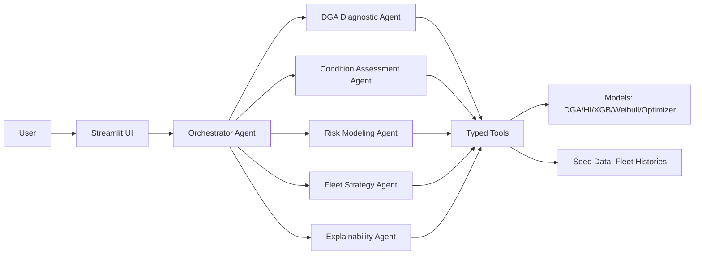

# ⚡ Transformer Risk Agent

**Agentic AI for transformer asset health, failure-risk prediction, and fleet strategy optimization.**

[](https://github.com/ogearchitect/transformer-risk-agent/actions/workflows/ci.yml)  [](https://opensource.org/licenses/MIT)

A polished demo application that simulates a utility transformer fleet, predicts multi-horizon failure risk (1/3/5/10 years), and exposes decisions through an interactive multi-agent chat experience.

> Ideal for utility customer demos, innovation showcases, and portfolio projects.

## What it is
- Multi-agent orchestration using **LangGraph + LangChain**
- Synthetic-but-realistic fleet with DGA, PD, bushing, maintenance, and operations data
- Hybrid modeling: **XGBoost + Weibull survival** + monetized risk
- Streamlit UX with persistent chat and tool-call traces
- Works with **no API key** (mock fallback), optionally uses OpenAI if configured

## Who it is for
- Utility asset-management leaders
- Reliability and maintenance engineering teams
- Solution architects showcasing agentic analytics apps

## Screenshots / GIF placeholders
- `docs/img/fleet-overview.png` (placeholder)
- `docs/img/asset-deep-dive.png` (placeholder)
- `docs/img/agent-chat.gif` (placeholder)

## Architecture


## Quickstart
```bash
git clone https://github.com/ogearchitect/transformer-risk-agent.git
cd transformer-risk-agent
pip install -r requirements.txt
streamlit run src/ui/app.py
```

## Demo Script (5 minutes)
1. **Fleet Overview**: show KPI cards, risk heatmap, ranked table.
2. **Asset Deep Dive**: pick a transformer, review DGA trends + Duval point + health index + narrative.
3. **What-If**: defer overhaul and increase loading, compare baseline vs scenario failure probability.
4. **Fleet Strategy**: adjust budget cap, inspect replacement schedule and spare strategy.
5. **Agent Chat** prompt examples:
   - “Show me the top 5 highest-risk transformers and why”
   - “Recommend a 5-year replacement plan with a $15M budget”
   - “Run a what-if: defer T-0104 overhaul by 2 years”

## Data dictionary
- `transformers.parquet`: id, nameplate, criticality, consequence, synthetic failure labels
- `dga_history.parquet`: monthly H₂, CH₄, C₂H₂, C₂H₄, C₂H₆, CO, CO₂
- `pd_history.parquet`: monthly partial discharge (pC)
- `bushing_history.parquet`: quarterly tan δ, capacitance, IR per phase
- `maintenance_log.parquet`: dated events + effectiveness
- `operational_history.parquet`: loading, through-faults, ambient, humidity

## Methodology notes
- **DGA**: Duval Triangle 1 + Rogers/Doernenburg ratios + IEEE C57.104 condition coding
- **Health Index (0–100)**: weighted blend of DGA, PD, bushing, age, maintenance compliance
- **Failure probability**: XGBoost classifier calibrated with Weibull survival estimates for 1/3/5/10 year horizons
- **Reproducibility**: deterministic RNG (`seed=42`) with a fixed mid-year reference date for stable age/features
- **Monetized risk**: `P(failure) × failure_consequence_usd`
- **Fleet strategy**: budget-constrained replacement ranking + Monte Carlo spare recommendation

## Project structure
```
transformer-risk-agent/
├── data/seed/
├── models/artifacts/
├── src/
│   ├── data/
│   ├── models/
│   ├── agents/
│   └── ui/
└── tests/
```

## Commands
- `make data` → generate deterministic seed datasets
- `make train` → train and save model artifacts
- `make demo` → launch Streamlit app
- `make test` → run pytest suite

## Limitations / disclaimer
This project uses **synthetic data** for demonstration only. It is not a production safety system and should not be used as a sole basis for operational decisions without engineering review and validated utility data.

## License
MIT (see `LICENSE`)
